# Лабораторная работа №2. Введение в WordPress
## Студент
**Gachayev Dmitrii I2302**  
**Выполнено 21.03.2026**  
## Цель работы
Научиться устанавливать WordPress в локальной среде, осваивать админ-панель, изменять внешний вид сайта через темы и расширять его функциональность с помощью плагинов.
# Выполнение
## Шаг 1. Подготовка среды
1. Устанавливаю `XAMPP`:

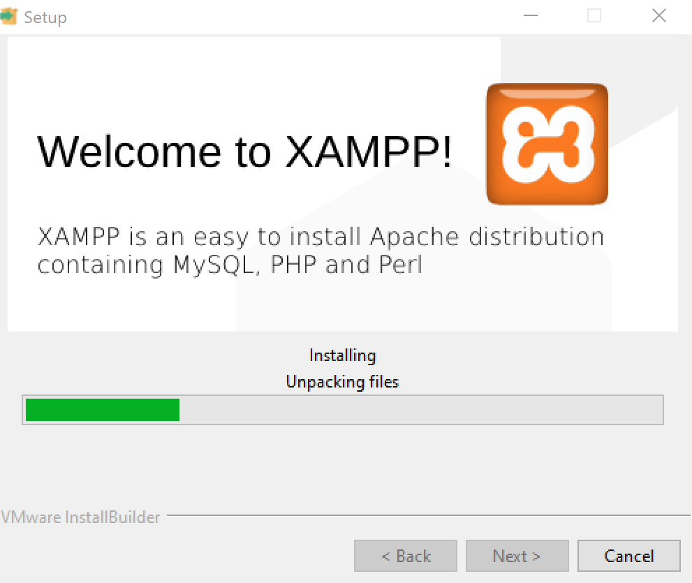

2. Запускаю модули Apache и MySQL. Проверяю, что `http://localhost` открывается:

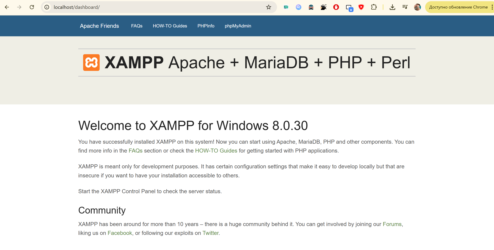

3. В `phpMyAdmin` создаю базу данных `wp_lab2`:

## Шаг 2. Установка WordPress

1. Скачиваю `WordPress` с `wordpress.org`:

2. Распаковываю архив в папку `htdocs`

3. В браузере открываю `http://localhost/wp_lab2` и прохожу процесс установки.

## Шаг 3. Первоначальные настройки сайта

1. В админ-панели перехожу в раздел Settings → General. Изменяю название сайта и часовой пояс:

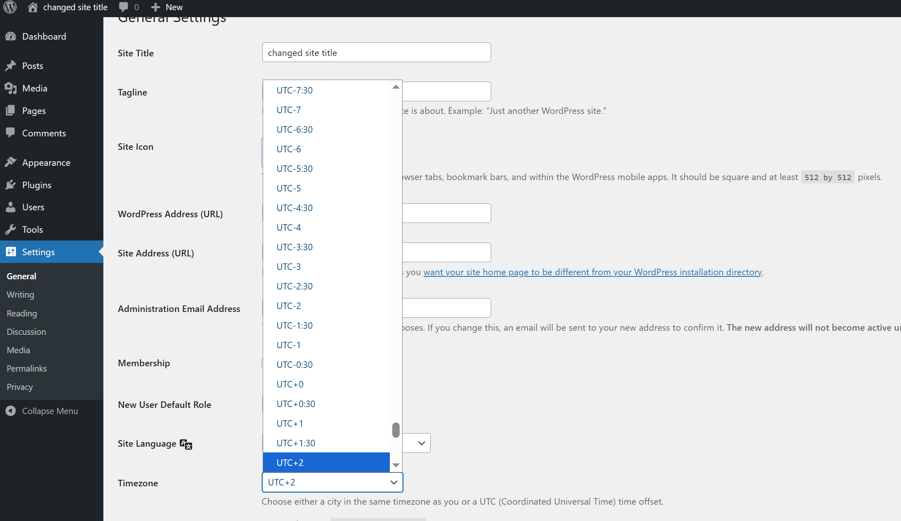

2. В разделе Settings → Permalinks устанавливаю вариант Post name для удобных ссылок:

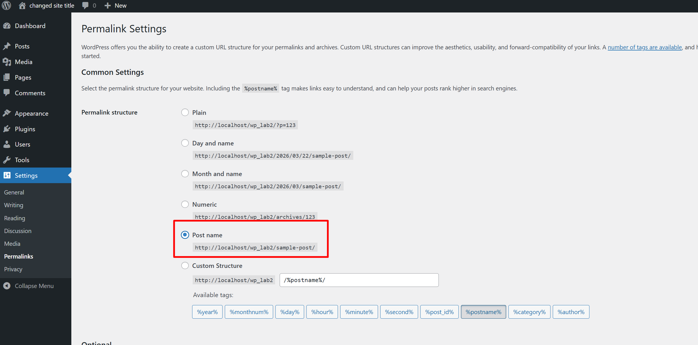

## Шаг 4. Работа с темами

1. Открываю раздел Appearance → Themes.

2. Устанавливаю новую тему из официального каталога.
3. Активирую тему и сравниваю, как изменился внешний вид сайта.

4. В меню Appearance → Customize настраиваю:
- логотип сайта,
- цветовую схему,
- заголовок и описание.

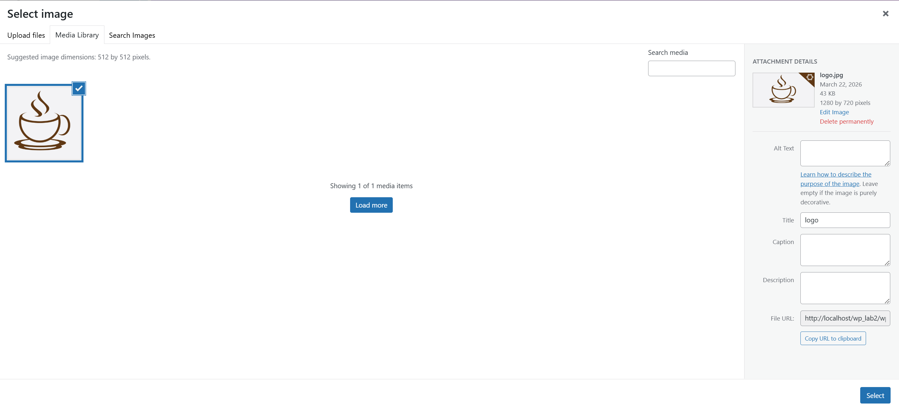

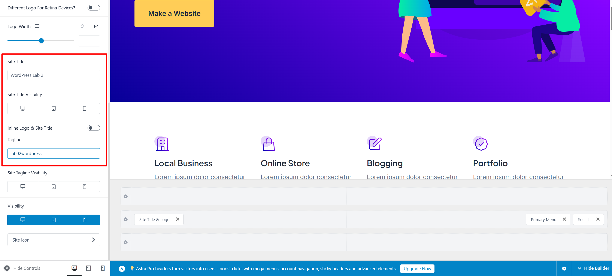

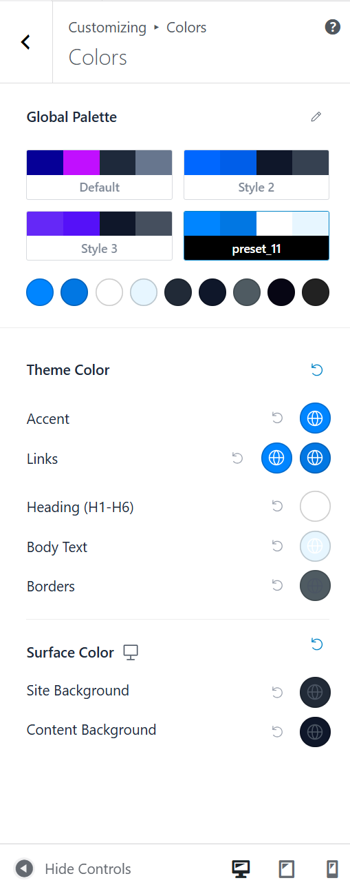

## Шаг 5. Работа с плагинами
1. Перехожу в раздел Plugins → Add New.

2. Установливаю и активирую:
- плагин Classic Editor;
- плагин Contact Form 7

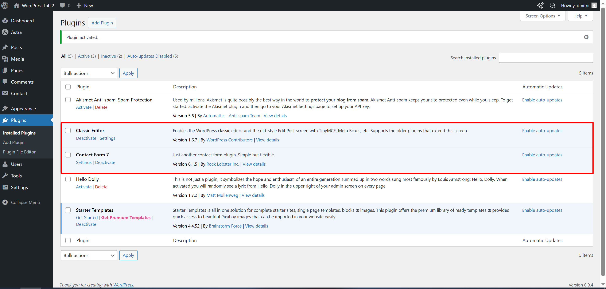

3. Проверяю новые возможности в админке (добавление записи с Classic Editor и создание формы через Contact Form 7).

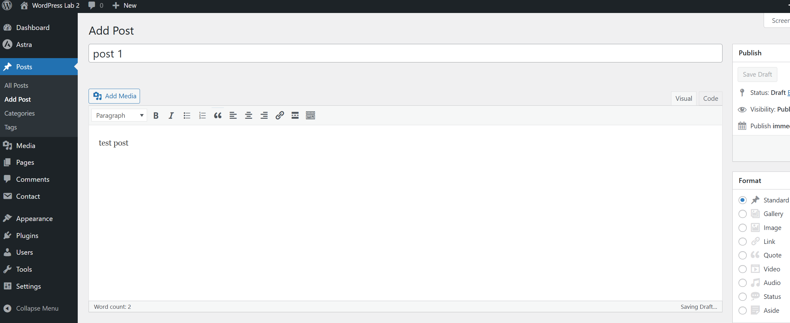

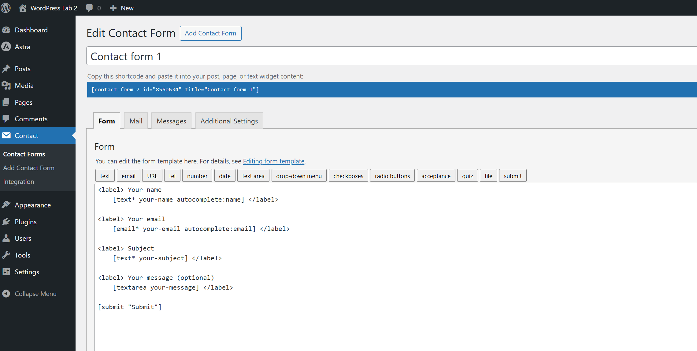

4. В разделе Plugins → Installed Plugins отключаю один из плагинов и убеждаюсь, что его функции пропали.

Удаляю Classic Editor, вижу новый интерфейс добавления постов:

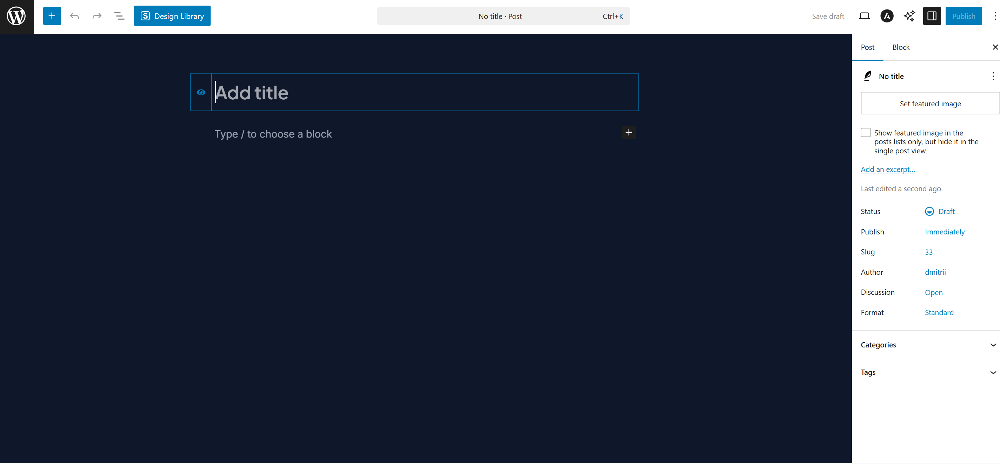

## Шаг 6. Создание контента

1. Создаю простую страницу «Контакты» и вставляю на неё форму обратной связи.

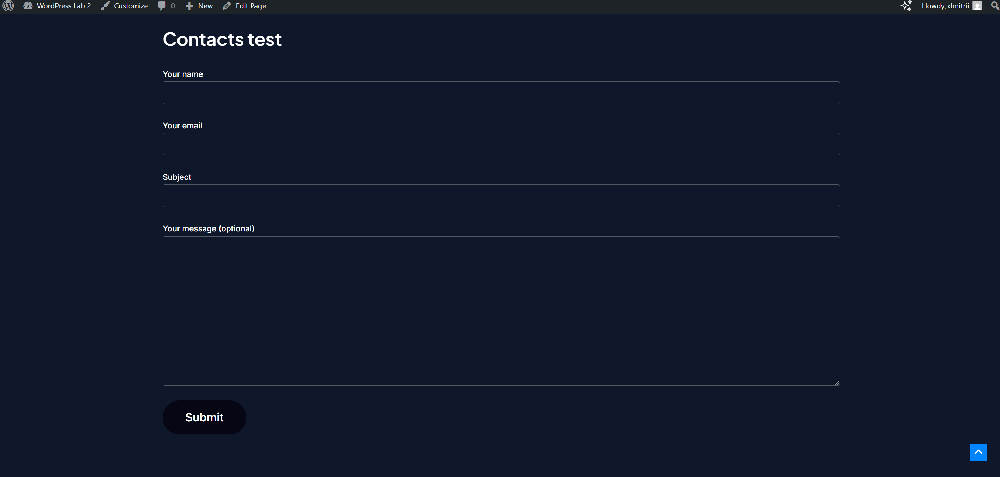

2. Создаю несколько записей в блоге с разным контентом (текст, изображения).

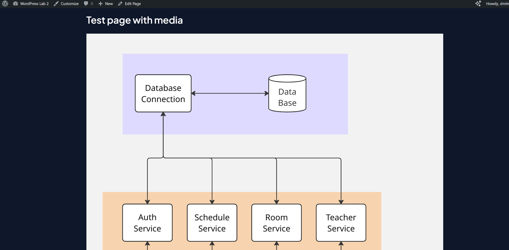

## Контрольные вопросы

- Что делает тема в WordPress, а что — плагин? 

Тема отвечает за внешний вид сайта, плагин - за функциональность

- Почему при смене темы контент сайта не теряется?

Контент хранится в базе данных, а тема только отображает его, поэтому при смене темы данные не пропадают

- Как можно изменить внешний вид сайта без редактирования кода?

Внешний вид можно менять через Appearance → Customize, выбором другой темы и настройками темы.

## Вывод
В ходе работы был установлен WordPress в локальной среде, выполнены базовые настройки сайта, изучена работа с темами и плагинами, а также создан простой контент, что позволило освоить основные возможности системы управления сайтом.