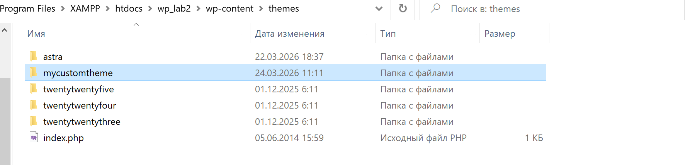
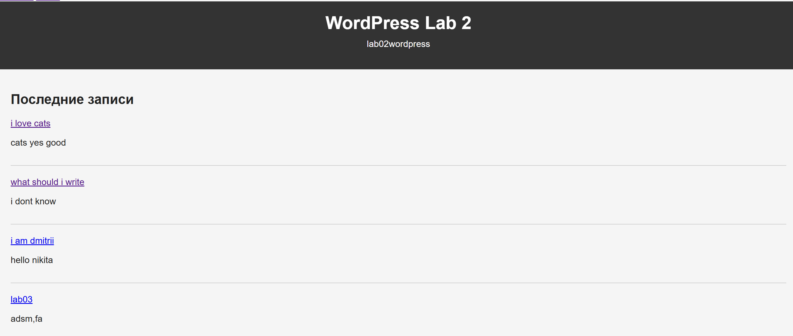
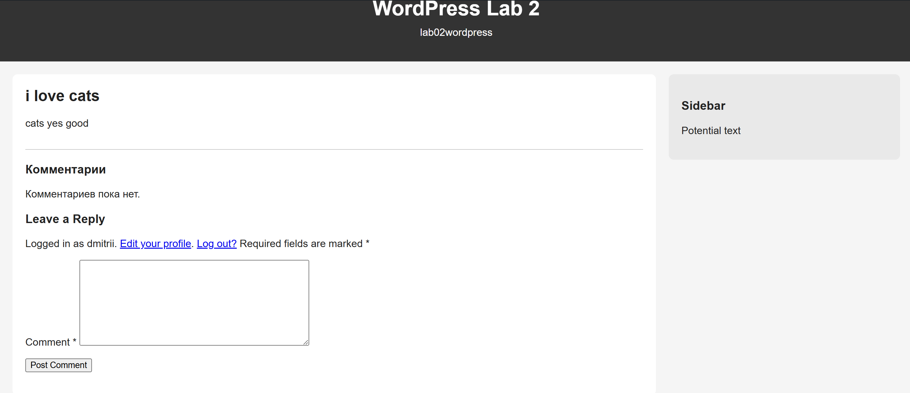

# Лабораторная работа №3. Разработка простой темы WordPress
## Студент
**Gachayev Dmitrii I2302**  
**Выполнено 22.03.2026**  
## Цель работы
# Выполнение
## Шаг 1. Подготовка среды
1. Создаю директорию `mycustomtheme` в `wp-content/themes`:



2. Включаю отладку в `wp-config.php`:
```php
define( 'WP_DEBUG', true);
```

## Шаг 2. Создание обязательных файлов темы

1. Создаю файл `style.css`:
```css
body {
    margin: 0;
    padding: 0;
    font-family: Arial, sans-serif;
    background-color: #f5f5f5;
    color: #222;
}

header {
    background-color: #333;
    color: white;
    padding: 20px;
    text-align: center;
}

main {
    padding: 20px;
}

footer {
    background-color: #333;
    color: white;
    text-align: center;
    padding: 15px;
    margin-top: 20px;
}
```
и `index.php`:
```php
<!DOCTYPE html>
<html lang="ru">
<head>
    <meta charset="UTF-8">
    <meta name="viewport" content="width=device-width, initial-scale=1.0">
    <title><?php bloginfo('name'); ?></title>
    <link rel="stylesheet" href="<?php echo get_stylesheet_uri(); ?>">
    <?php wp_head(); ?>
</head>
<body>
    <header>
        <h1><?php bloginfo('name'); ?></h1>
        <p><?php bloginfo('description'); ?></p>
    </header>

    <main>
        <h2>Hello World</h2>
        <p>Its index.php</p>
    </main>

    <footer>
        <p>&copy; <?php echo date('Y'); ?> <?php bloginfo('name'); ?></p>
    </footer>

    <?php wp_footer(); ?>
</body>
</html>
```

## Шаг 3. Общие части шаблонов

1. Создаю файл `header.php` и переношу туда код шапки сайта:
```php
<!DOCTYPE html>
<html lang="ru">
<head>
    <meta charset="UTF-8">
    <meta name="viewport" content="width=device-width, initial-scale=1.0">
    <title><?php bloginfo('name'); ?></title>
    <link rel="stylesheet" href="<?php echo get_stylesheet_uri(); ?>">
    <?php wp_head(); ?>
</head>
<body>

<header>
    <h1><?php bloginfo('name'); ?></h1>
    <p><?php bloginfo('description'); ?></p>
</header>

<main>
```

2. Создаю файл `footer.php` и переношу туда код подвала сайта:
```php
</main>

<footer>
    <p>&copy; <?php echo date('Y'); ?> <?php bloginfo('name'); ?></p>
</footer>

<?php wp_footer(); ?>
</body>
</html>
```

3. В `index.php` подключаю `header.php` и `footer.php` с помощью функций `get_header()` и `get_footer()`. На главной странице вывожу список последних записей (5 штук) с помощью цикла WordPress:
```php
<?php get_header(); ?>

<h2>Последние записи</h2>

<?php
$query = new WP_Query([
    'posts_per_page' => 5
]);

if ($query->have_posts()) :
    while ($query->have_posts()) : $query->the_post();
?>

    <article>
        <h3><?php the_title(); ?></h3>
        <p><?php the_excerpt(); ?></p>
    </article>

<?php
    endwhile;
    wp_reset_postdata();
else :
?>

    <p>Нет записей</p>

<?php endif; ?>

<?php get_footer(); ?>
```
## Шаг 4. Файл функций
1. Создаю файл `functions.php` в папке темы.

2. В `functions.php` добавляю функцию для подключения стилей темы с помощью `wp_enqueue_style()`:
```php
<?php

function mytheme_enqueue_styles() {
    wp_enqueue_style(
        'mycustomtheme',
        get_stylesheet_uri()
    );
}

add_action('wp_enqueue_scripts', 'mytheme_enqueue_styles');
```

## Шаг 5. Дополнительные шаблоны
1. Создаю файл `single.php` для отображения отдельного поста.:
```php
<?php get_header(); ?>

<div class="content-with-sidebar">
    <section class="content">
        <?php if (have_posts()) : while (have_posts()) : the_post(); ?>
            <article>
                <h2><?php the_title(); ?></h2>
                <div>
                    <?php the_content(); ?>
                </div>
            </article>

            <?php comments_template(); ?>

        <?php endwhile; endif; ?>
    </section>

    <?php get_sidebar(); ?>
</div>

<?php get_footer(); ?>
```
2. Создаю файл `page.php` для отображения страниц:
```php
<?php get_header(); ?>

<div class="content-with-sidebar">
    <section class="content">
        <?php if (have_posts()) : while (have_posts()) : the_post(); ?>
            <article>
                <h2><?php the_title(); ?></h2>
                <div>
                    <?php the_content(); ?>
                </div>
            </article>

            <?php comments_template(); ?>

        <?php endwhile; endif; ?>
    </section>

    <?php get_sidebar(); ?>
</div>

<?php get_footer(); ?>
```

3. Создаю файл `sidebar.php` для боковой панели и подключаю его в нужных шаблонах с помощью get_sidebar():
```php
<aside class="sidebar">
    <h3>Sidebar</h3>
    <p>Potential text</p>
</aside>
```

4. Создаю файл `comments.php` для отображения комментариев и подключаю его в `single.php` и `page.php`:

```php
<?php if (post_password_required()) {
    return;
} ?>

<div class="comments-section">
    <h3>Комментарии</h3>

    <?php if (have_comments()) : ?>
        <ul>
            <?php wp_list_comments(); ?>
        </ul>
    <?php else : ?>
        <p>Комментариев пока нет.</p>
    <?php endif; ?>

    <?php comment_form(); ?>
</div>
```

5. Создаю файл `archive.php` для отображения архивов записей:
```php
<?php get_header(); ?>

<div class="content-with-sidebar">
    <section class="content">
        <h2><?php the_archive_title(); ?></h2>
        <p><?php the_archive_description(); ?></p>

        <?php if (have_posts()) : while (have_posts()) : the_post(); ?>
            <article>
                <h3>
                    <a href="<?php the_permalink(); ?>">
                        <?php the_title(); ?>
                    </a>
                </h3>
                <p><?php the_excerpt(); ?></p>
            </article>
        <?php endwhile; else : ?>
            <p>Записей не найдено.</p>
        <?php endif; ?>
    </section>

    <?php get_sidebar(); ?>
</div>

<?php get_footer(); ?>
```

## Шаг 6. Стилизация темы
Добавляю стили для основных элементов темы:
```css
/*
Theme Name: mycustomtheme
*/

body {
    margin: 0;
    font-family: Arial, sans-serif;
    background-color: #f5f5f5;
    color: #222;
}

header {
    background-color: #333;
    color: white;
    padding: 20px;
    text-align: center;
}

header h1 {
    margin: 0;
}

header p {
    margin-top: 10px;
}

main {
    padding: 20px;
}

.content-with-sidebar {
    display: flex;
    gap: 20px;
    align-items: flex-start;
}

.content {
    flex: 3;
    background: white;
    padding: 20px;
    border-radius: 8px;
}

.sidebar {
    flex: 1;
    background: #e9e9e9;
    padding: 20px;
    border-radius: 8px;
}

article {
    margin-bottom: 20px;
    padding-bottom: 15px;
    border-bottom: 1px solid #ccc;
}

article h2,
article h3 {
    margin-top: 0;
}

footer {
    background-color: #333;
    color: white;
    text-align: center;
    padding: 15px;
    margin-top: 20px;
}
```


## Шаг 7. Скриншот темы
1. Добавляю в папку темы файл `screenshot.png` - изображение-превью темы 

## Шаг 8. Активация темы
В админ-панели `WordPress` перехожу в раздел `Appearance → Themes`, нахожу свою тему и активирую её. Проверяю изменения:





## Контрольные вопросы
- Какие два файла являются обязательными для любой темы WordPress?

`style.css` и `index.php`

- Как подключаются общие части шаблонов (header, footer, sidebar)?

Через функции `get_header()`, `get_footer()`, `get_sidebar()`

- Чем отличаются `index.php`, `single.php` и `page.php`?

`index.php` - общий шаблон и список постов, 

`single.php` - отдельный пост, 

`page.php` - отдельная страница

- Зачем нужен файл `functions.php` в теме?

Для добавления функциональности темы (подключение стилей, скриптов, настройка темы)

## Источники:
1. Документация Wordpress - https://wordpress.org/documentation/

## Вывод
В ходе работы была разработана простая тема WordPress с базовой структурой и шаблонами. Были реализованы основные файлы темы, подключены стили и разбита верстка на переиспользуемые части. Также был изучен механизм шаблонов WordPress и работа цикла для вывода записей. В результате получен рабочий прототип темы с отображением постов, страниц, архивов и комментариев.