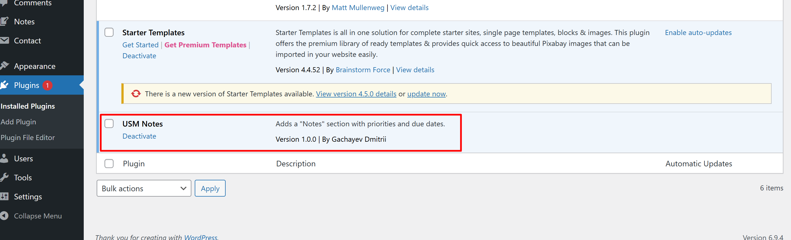
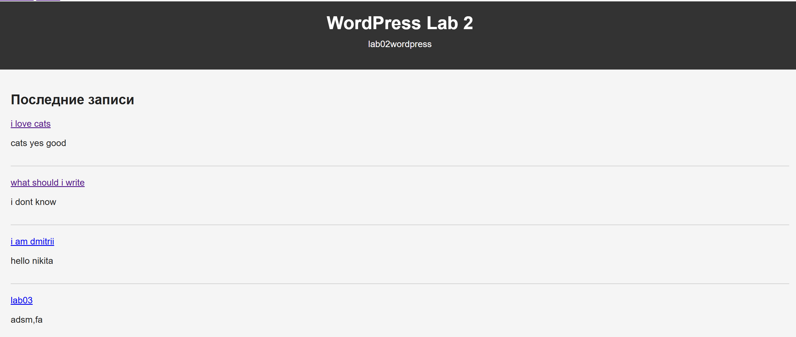
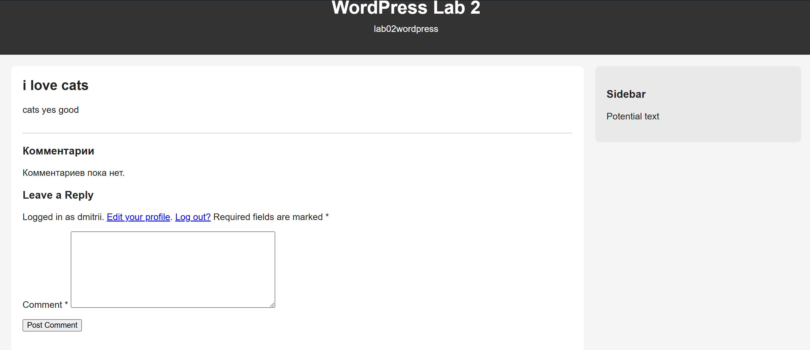
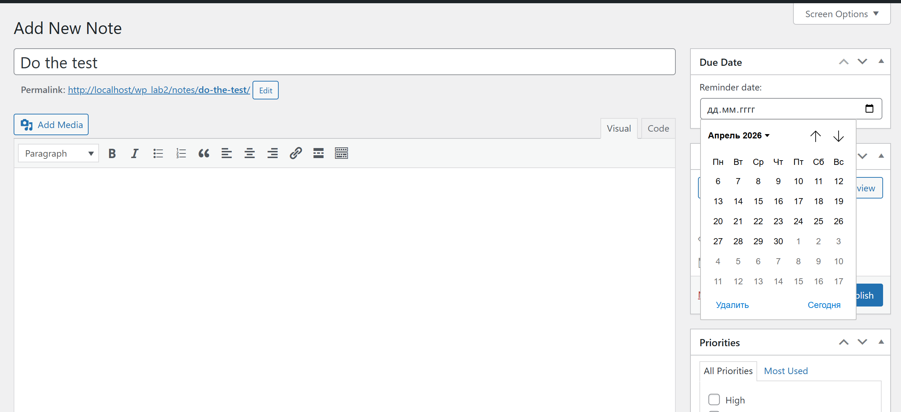
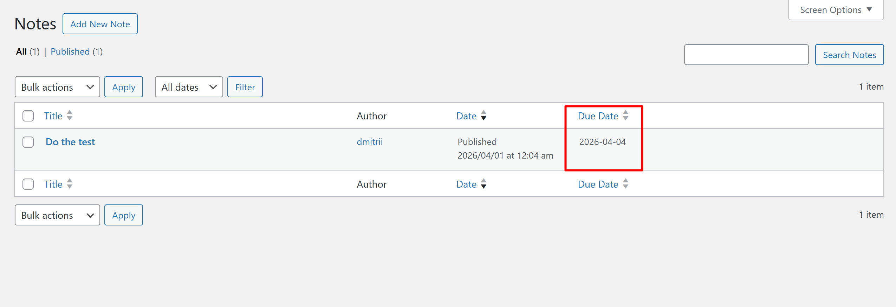
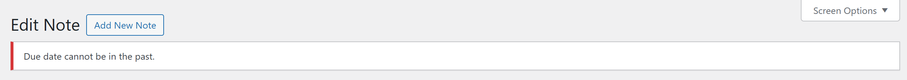
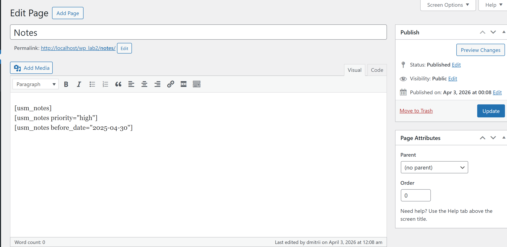
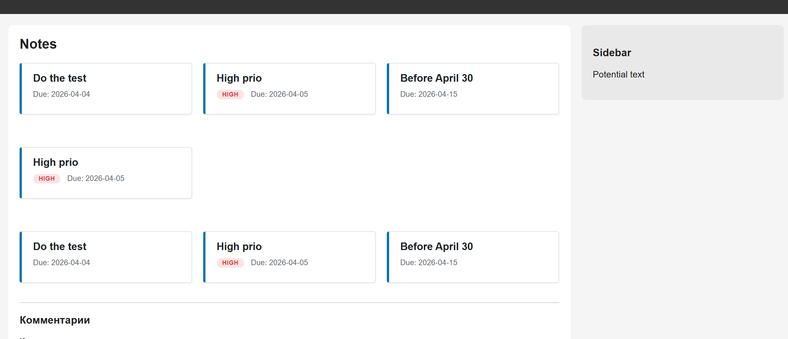

# Лабораторная работа №4. Разработка плагина для WordPress

## Студент
**Gachayev Dmitrii I2302**  
**Выполнено 03.04.2026**

## Цель работы
Освоить расширяемую модель данных WordPress: создать CPT (Custom Post Type), пользовательскую таксономию, метаданные с метабоксом в админ-панели, а также реализовать шорткод для отображения данных на сайте.

## Описание плагина
Плагин **USM Notes** добавляет в WordPress раздел «Заметки» (Notes) с возможностью присвоения приоритетов (High / Medium / Low) и указания даты напоминания (Due Date). Заметки можно выводить на любой странице с помощью шорткода `[usm_notes]` с фильтрацией по приоритету и дате.

---

## Выполнение

### Шаг 1. Подготовка среды

1. В локальной установке WordPress (XAMPP) перешёл в папку `wp-content/plugins`.
2. Создал директорию `usm-notes` для плагина.
3. Включил отладку в `wp-config.php`:

```php
define('WP_DEBUG', true);
```

### Шаг 2. Создание основного файла плагина

В папке `usm-notes` создал файл `usm-notes.php` с метаданными плагина:

```php
<?php
/**
 * Plugin Name: USM Notes
 * Description: Adds a "Notes" section with priorities and due dates.
 * Version: 1.0.0
 * Author: Gachayev Dmitrii
 * Text Domain: usm-notes
 */
```

После этого активировал плагин в админ-панели WordPress:



### Шаг 3. Регистрация Custom Post Type (CPT)

Добавил функцию `usm_register_notes_cpt()`, которая регистрирует CPT `usm_note` с помощью `register_post_type()`. Функция вызывается на хуке `init`.

Ключевые параметры:

| Параметр | Значение | Назначение |
|----------|----------|------------|
| `public` | `true` | CPT доступен на фронтенде и в админке |
| `has_archive` | `true` | Включает архивную страницу `/notes/` |
| `show_in_rest` | `true` | Поддержка REST API и блочного редактора Gutenberg |
| `supports` | `title, editor, author, thumbnail` | Поля, доступные в редакторе записи |
| `menu_icon` | `dashicons-edit-page` | Иконка в меню админки |
| `rewrite` | `['slug' => 'notes']` | Адрес: `/notes/` |

После сохранения файла в админке появился новый пункт меню **Notes**.



### Шаг 4. Регистрация пользовательской таксономии

Добавил функцию `usm_register_priority_taxonomy()`, которая регистрирует иерархическую таксономию `usm_priority` с помощью `register_taxonomy()` и привязывает её к CPT `usm_note`.

Ключевые параметры:

| Параметр | Значение | Назначение |
|----------|----------|------------|
| `hierarchical` | `true` | Работает как категории (а не теги) |
| `public` | `true` | Доступна на фронтенде |
| `show_in_rest` | `true` | Поддержка REST API |

В подменю Notes появился пункт **Priorities**, где можно создать термины: High, Medium, Low.



### Шаг 5. Добавление метабокса для даты напоминания

Создал метабокс «Due Date» с помощью `add_meta_box()`, который отображается в боковой панели редактора записи.

**Особенности реализации:**

1. **HTML-поле** - используется `<input type="date">` с атрибутом `required`.

2. **Безопасность (nonce)** - при рендере метабокса создаётся nonce-поле:
```php
wp_nonce_field( 'usm_save_due_date', 'usm_due_date_nonce' );
```
При сохранении проверяется:
```php
if ( ! wp_verify_nonce( $_POST['usm_due_date_nonce'], 'usm_save_due_date' ) ) {
    return;
}
```

3. **Валидация даты** - дата не может быть в прошлом. Если дата невалидна, сообщение об ошибке сохраняется в transient и выводится через хук `admin_notices`:

```php
if ( $date < current_time( 'Y-m-d' ) ) {
    set_transient( 'usm_due_date_error_' . $post_id, 'Due date cannot be in the past.', 30 );
    return;
}
```

4. **Колонка в списке записей** - дата напоминания отображается в отдельной колонке «Due Date» на странице списка заметок. Колонка реализована через фильтры `manage_usm_note_posts_columns` и `manage_usm_note_posts_custom_column`. Также колонка сделана сортируемой.



*Метабокс Due Date в редакторе заметки*



*Колонка Due Date в списке записей*



*Ошибка валидации при попытке указать прошедшую дату*

### Шаг 6. Создание шорткода для отображения заметок

Создал шорткод `[usm_notes]` с двумя необязательными атрибутами:
- `priority` - фильтр по slug приоритета (например, `high`)
- `before_date` - фильтр по дате напоминания (формат `YYYY-MM-DD`)

**Логика работы:**
- Используется `WP_Query` для получения записей типа `usm_note`
- Если указан `priority` - добавляется `tax_query` по таксономии `usm_priority`
- Если указан `before_date` - добавляется `meta_query` по ключу `_usm_due_date` с оператором `<=`
- Если записей нет - выводится сообщение: «Нет заметок с заданными параметрами»

**Стилизация:** карточки заметок оформлены с помощью CSS Grid. Приоритеты отображаются цветными бейджами:
- **High** - красный
- **Medium** - жёлтый
- **Low** - зелёный

Примеры использования:
```
[usm_notes]                              - все заметки
[usm_notes priority="high"]              - только с высоким приоритетом
[usm_notes before_date="2026-04-30"]     - с датой до 30 апреля 2026
```



### Шаг 7. Тестирование плагина

- Созданы несколько заметок с различными параметрами
- Создана страница «All Notes» с тремя вариантами шорткода. Все фильтры работают корректно.




## Контрольные вопросы

### 1. Чем пользовательская таксономия принципиально отличается от метаполя?

**Таксономия** - это система классификации, предназначенная для группировки записей по общему признаку. Она создаёт отдельные страницы архивов, поддерживает иерархию и позволяет эффективно фильтровать записи.

**Метаполе (post meta)** - это произвольное значение, привязанное к конкретной записи. Оно хранится в таблице `wp_postmeta` как пара ключ-значение и предназначено для уникальных данных записи.

### 2. Зачем нужен nonce при сохранении метаполей?

**Nonce** (Number used once) - это токен безопасности, защищающий от **CSRF-атак** (Cross-Site Request Forgery). При рендере формы WordPress генерирует уникальный токен с помощью `wp_nonce_field()`, а при обработке данных проверяет его через `wp_verify_nonce()`.

**Если nonce не проверять**, злоумышленник может создать вредоносную страницу, которая отправит POST-запрос к WordPress от имени авторизованного пользователя.

### 3. Какие аргументы register_post_type() и register_taxonomy() чаще всего важны для фронтенда и UX?

1. **`public`** - определяет, будет ли CPT/таксономия доступна на фронтенде и в поиске. Если `false`, записи не будут отображаться для посетителей сайта. Это главный параметр, влияющий на видимость контента.

2. **`has_archive`** (для CPT) - включает архивную страницу (например, `/notes/`), где отображаются все записи данного типа. Без этого параметра пользователи смогут просматривать только отдельные записи, но не их общий список.

3. **`rewrite`** - настраивает url. Параметр `slug` определяет часть URL (например, `notes` вместо `usm_note`). Правильный slug важен для SEO и удобства навигации.

## Инструкции по запуску

1. Скопируйте папку `usm-notes/` в `wp-content/plugins/` вашей установки WordPress
2. Активируйте плагин **USM Notes** в разделе «Plugins» админ-панели
3. Перейдите в **Notes → Priorities** и создайте три термина: `High`, `Medium`, `Low`
4. Создайте несколько заметок в разделе **Notes → Add New**, указав приоритет и дату
5. Создайте страницу и вставьте шорткод `[usm_notes]` для отображения заметок

## Список использованных источников

1. WordPress Developer Resources - Custom Post Types: https://developer.wordpress.org/plugins/post-types/
2. WordPress Developer Resources - Taxonomies: https://developer.wordpress.org/plugins/taxonomies/
3. WordPress Developer Resources - Metadata: https://developer.wordpress.org/plugins/metadata/
4. WordPress Developer Resources - Shortcodes: https://developer.wordpress.org/plugins/shortcodes/
5. WordPress Code Reference - register_post_type(): https://developer.wordpress.org/reference/functions/register_post_type/
6. WordPress Code Reference - register_taxonomy(): https://developer.wordpress.org/reference/functions/register_taxonomy/
