# Лабораторная работа №5. Безопасность WordPress

## Студент
**Gachayev Dmitrii I2302**  
**Выполнено 05.04.2026**

## Цель работы
Закрепить ключевые практики безопасности WordPress: управление ролями и паролями, обновления, базовое hardening (wp-config.php, права, отключение редактора), резервное копирование, мониторинг активности и поэтапная настройка All In One WP Security & Firewall (AIOS) для защиты от брутфорса, базового WAF и контроля прав.

---

## Выполнение

### Шаг 1. Подготовка среды

1. Перешёл в админ-панель локальной установки WordPress (XAMPP) по адресу `http://localhost/wp_lab2/wp-admin`.
2. Убедился, что имеется доступ администратора.
3. Включил отладку в файле `wp-config.php`, добавив следующую строку:

```php
define('WP_DEBUG', true);
```
---

### Шаг 2. Управление ролями и паролями

1. Перешёл в **Пользователи → Добавить нового**.
2. Создал тестового пользователя с ролью **Автор**:
   - Логин: `test_author`
   - Email: `test@example.com`
   - Роль: Автор

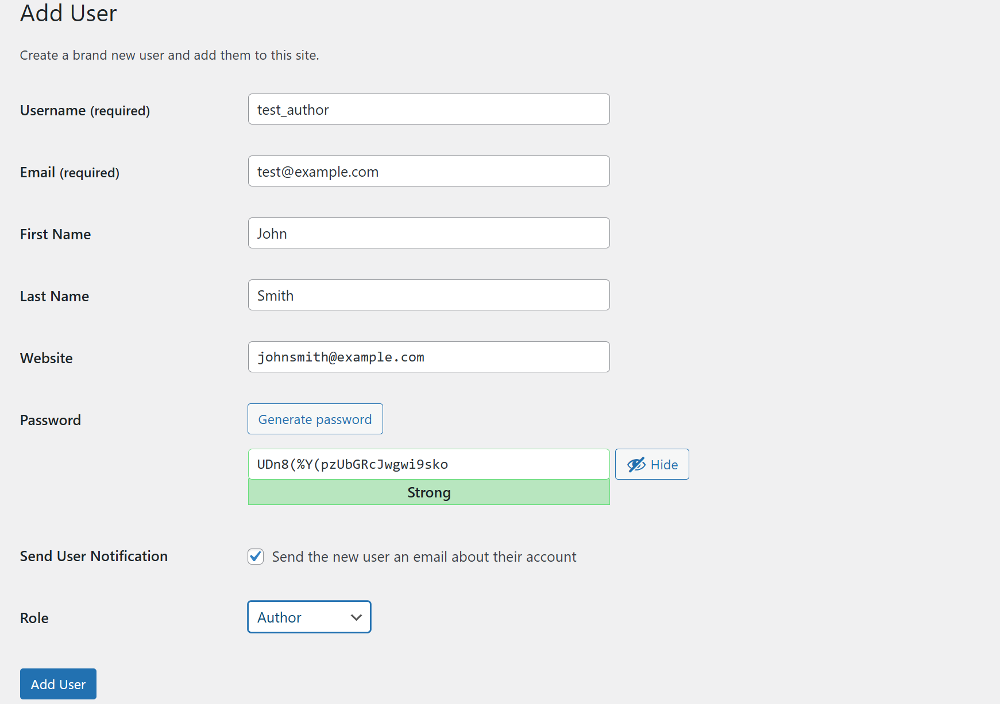

3. Проверил, что у каждого администратора установлен сложный пароль (8+ символов, содержит буквы, цифры и спецсимволы).

---

### Шаг 3. Обновления ядра, тем и плагинов

1. Перешёл в **Консоль → Обновления** и проверил наличие обновлений для WordPress, тем и плагинов.

2. Обновил всё до последних версий.

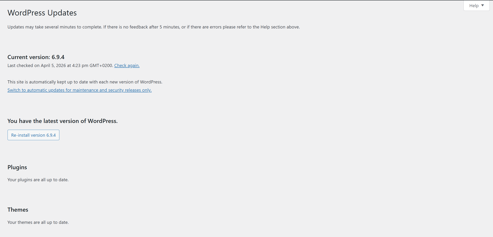

3. Настроил автоматические обновления для тем и плагинов:
   - В разделе **Плагины** включил автообновление для каждого установленного плагина.
   - В разделе **Внешний вид → Темы** включил автообновление для активной темы.

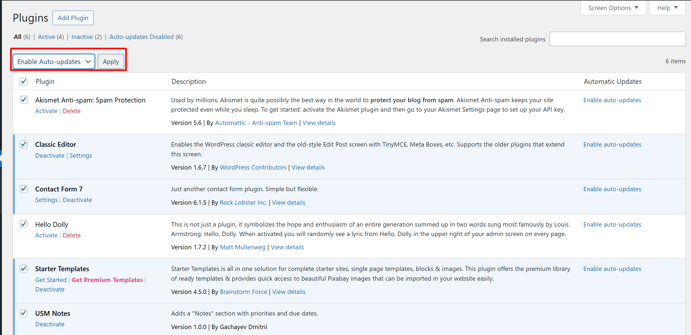

4. Проверил, что все обновления прошли успешно и сайт работает корректно.

---

### Шаг 4. Базовое hardening

1. Запрет редактирования файлов из админки

Добавил в `wp-config.php`:

```php
define('DISALLOW_FILE_EDIT', true);
```

После этого пункт **Редактор** исчез из меню **Внешний вид** и **Плагины**.

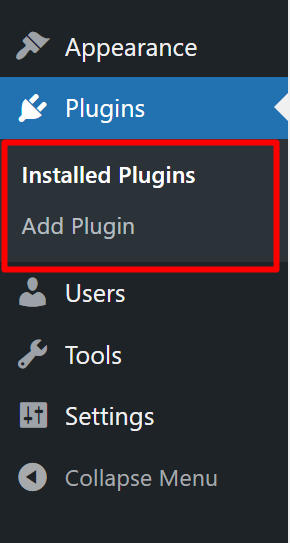 

2. Настройка прав на файлы и папки

На production-сервере (Linux) необходимо установить верные права доступа:
- Папки: `755`
- Файлы: `644`

```bash
find /path/to/wordpress -type d -exec chmod 755 {} \;
find /path/to/wordpress -type f -exec chmod 644 {} \;
```

На локальной среде (Windows/XAMPP) права управляются через свойства файлов и ACL. Проверил, что файлы WordPress доступны только текущему пользователю и не имеют общего доступа.

3. Защита wp-config.php

Добавил в файл `.htaccess` в корне сайта:

```apache
<files wp-config.php>
  order allow,deny
  deny from all
</files>
```

---

### Шаг 5. Установка и настройка All In One WP Security & Firewall (AIOS)

#### 5.1. Установка плагина

1. Перешёл в **Плагины → Добавить новый**, нашёл **All In One WP Security & Firewall**.
2. Установил и активировал плагин.

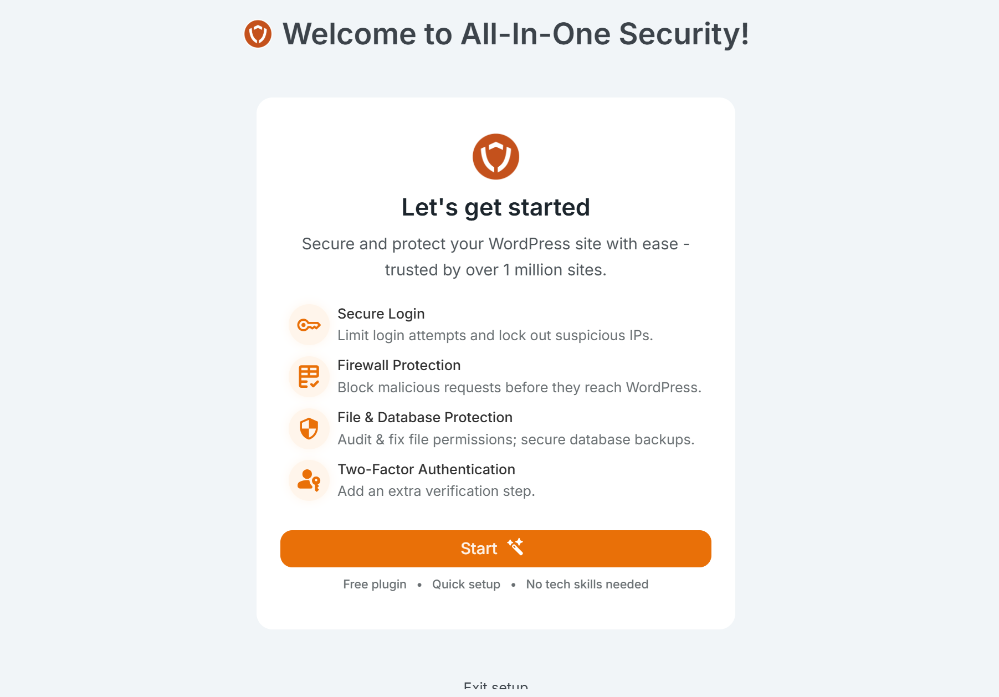

#### 5.2. User Login  - Login Lockdown

Перешёл в **WP Security → User Login → Login Lockdown** и настроил:

| Параметр | Значение | Назначение |
|----------|----------|------------|
| Enable Login Lockdown | Включено | Активирует блокировку при неудачных попытках |
| Max Login Attempts | 5 | Максимум попыток до блокировки |
| Login Retry Time Period | 15 мин | Интервал, в котором считаются попытки |
| Lockout Time | 30 мин | Время блокировки IP |

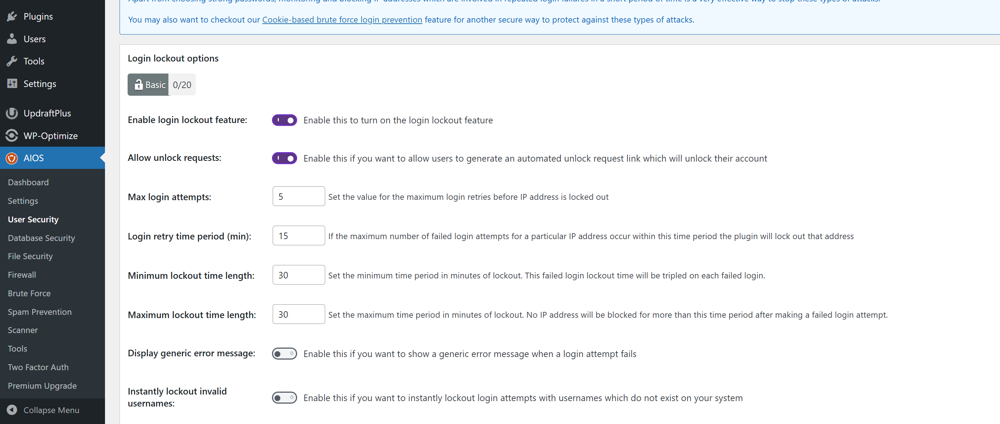

#### 5.3. User Login  - Force Logout

Включил **Force Logout** с таймаутом **1440 минут (24 часа)** для ограничения бессрочных сессий.

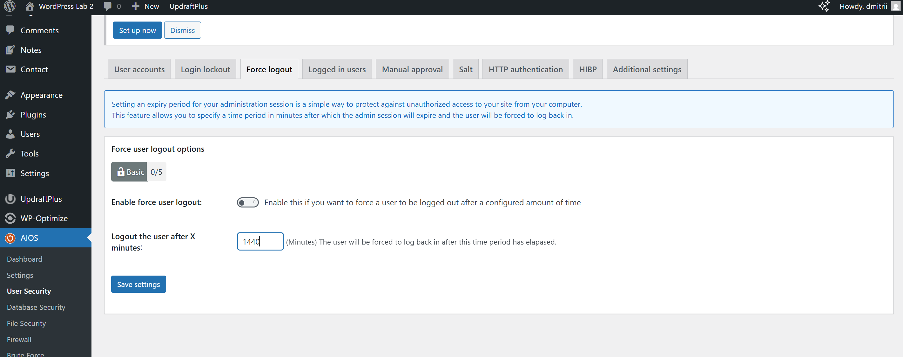

#### 5.4. User Accounts

Проверил, нет ли пользователя с логином `admin`. Логин администратора отличается от `admin`, поэтому переименование не требуется.

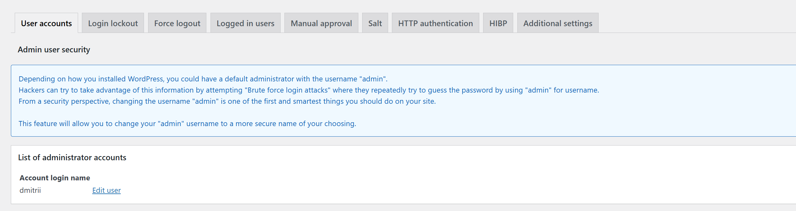

#### 5.5. User Registration

Включил ручное одобрение новых пользователей в разделе **WP Security → User Registration**, чтобы предотвратить автоматическую регистрацию ботов.

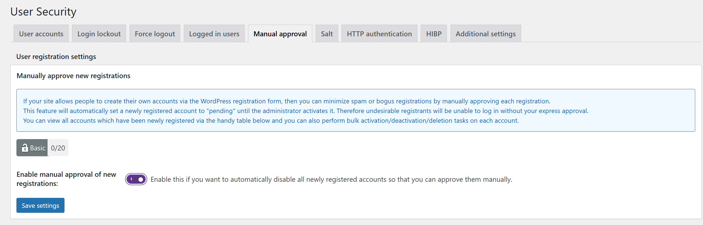

#### 5.6. Filesystem Security

Попытался запустить проверку **File Permissions** в разделе **WP Security → Filesystem Security**. Данная функция недоступна при запуске на Windows Server.

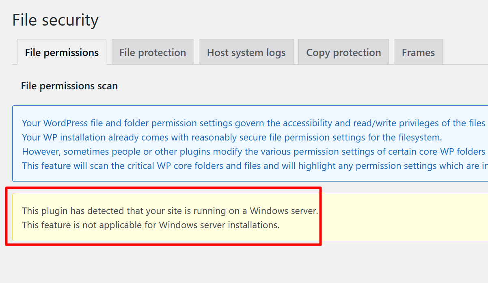

#### 5.7. Firewall

1. Активировал **Basic Firewall** в разделе **WP Security → Firewall**.
2. Включил защиту от:
   - Bad Query Strings
   - XSS-атак
   - Directory Browsing

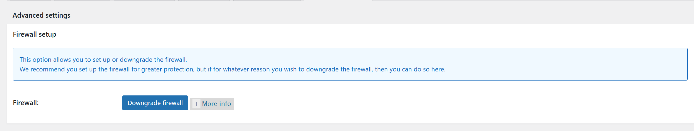

#### 5.8. Brute Force  - Rename Login Page

Изменил URL страницы входа с `/wp-login.php` на нестандартный `/login-secure` в разделе **WP Security → Brute Force**.

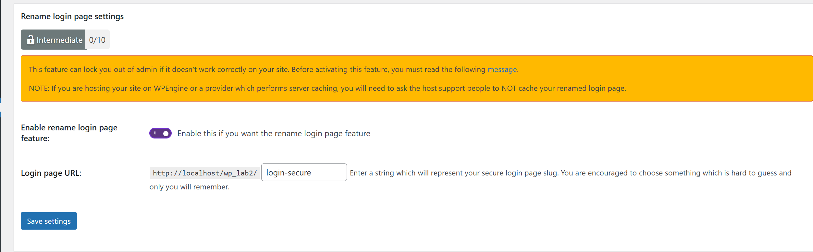

#### 5.9. Scanner  - File Change Detection

Настроил **File Change Detection** в разделе **WP Security → Scanner**:
- Включил обнаружение изменений файлов.
- Настроил уведомления на email.

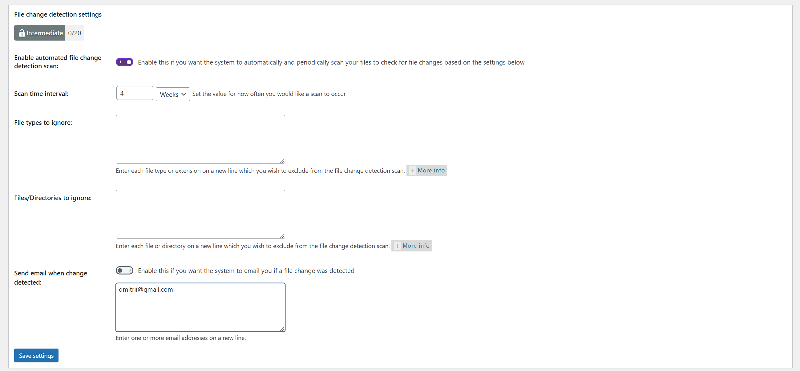

#### 5.10. Backup  - Резервная копия БД

Перешёл в **WP Security → Database Security → DB Backup**:
1. Создал резервную копию базы данных.
2. Настроил расписание автоматического резервного копирования.

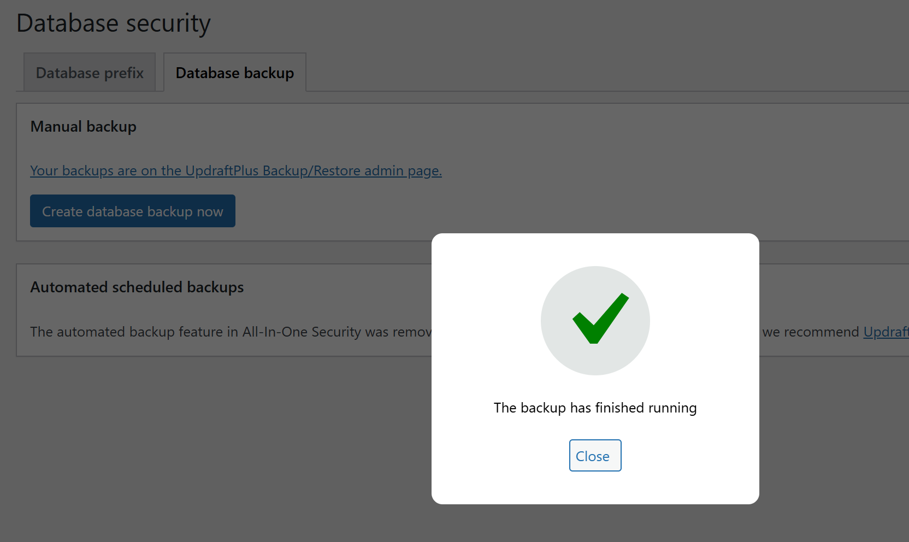

#### 5.11. Notifications  - Email-уведомления

Включил email-уведомления для важных событий:
- Блокировка при неудачных попытках входа (Lockout)
- Регистрация нового администратора
- Изменение файлов

---

### Шаг 6. Проверка защиты от брутфорса

1. Вышел из админки и открыл приватное окно браузера.
2. Перешёл на новый URL входа `/login-secure`.
3. Ввёл неправильный пароль 6 раз подряд для тестового пользователя `test_author`.
4. После 5-й попытки сработала блокировка  - отображено сообщение о временной блокировке IP.
5. Проверил запись о блокировке в **WP Security → Dashboard / Logs**.
6. Разблокировал тестовый IP через панель управления AIOS.

---

### Шаг 7. Восстановление из резервной копии

1. Удалил тестовую запись и одно произвольное изображение из медиабиблиотеки.
2. Восстановил базу данных из ранее созданной резервной копии (импорт SQL через phpMyAdmin).
3. Проверил целостность данных  - удалённые запись и изображение восстановлены.
---

## Контрольные вопросы

**1. Почему DISALLOW_FILE_EDIT и правильные права на wp-config.php существенно уменьшают риск пост-эксплойта?**

DISALLOW_FILE_EDIT убирает редактор файлов из админки, лишая атакующего возможности внедрить бэкдор через браузер даже при компрометации учётки админа. Защита wp-config.php (права 644 + deny в .htaccess) скрывает учётные данные БД и секретные ключи от чтения через уязвимости вроде LFI. Вместе эти меры блокируют два основных вектора закрепления после взлома.

**2. Какие параметры Login Lockdown/Firewall вы выбрали и почему?**

Max Login Attempts: 5 - пользователь может ошибиться, но для брутфорса недостаточно. Retry Period: 15 мин - ловит серию атак, не мешает обычным пользователям. Lockout Time: 30 мин - отпугивает автоматизированные инструменты, но не блокирует надолго. Firewall на базовом уровне, чтобы не ломать REST API плагинов; фильтры Bad Query Strings и XSS как наиболее частые атаки.

**3. Чем отличаются меры защиты на уровне WordPress от мер на уровне веб-сервера и ОС?**

WordPress-плагины (AIOS) работают внутри PHP - анализируют бизнес-логику (роли, попытки входа), но срабатывают поздно и не защищают от атак мимо WordPress. Веб-сервер (.htaccess, mod_security, SSL) блокирует запросы до PHP - быстрее и эффективнее. ОС (chmod, iptables, fail2ban) - самый надёжный уровень, контролирует файлы, порты и процессы. Нужны все три уровня одновременно (defense in depth).

**4. Что включать в полный бэкап WP и как проверить восстановление?**

Полный бэкап: база данных MySQL, папка wp-content (темы, плагины, uploads), корневые файлы (wp-config.php, .htaccess), конфигурация сервера. Проверка: развернуть бэкап на отдельной среде, убедиться что сайт работает, все посты/медиа/пользователи на месте.

---

## Вывод

В ходе лабораторной работы были изучены и применены ключевые практики безопасности WordPress: настроено управление ролями и паролями, выполнены обновления ядра и расширений, проведено базовое hardening (отключение редактора, настройка прав, защита wp-config.php). Установлен и поэтапно настроен плагин All In One WP Security & Firewall: Login Lockdown, Force Logout, Firewall, Rename Login Page, File Change Detection, резервное копирование БД и email-уведомления. Проверена защита от брутфорса на тестовом пользователе и выполнено успешное восстановление из резервной копии. Полученные навыки формируют базовый уровень защиты WordPress-сайта по принципу эшелонированной обороны.
